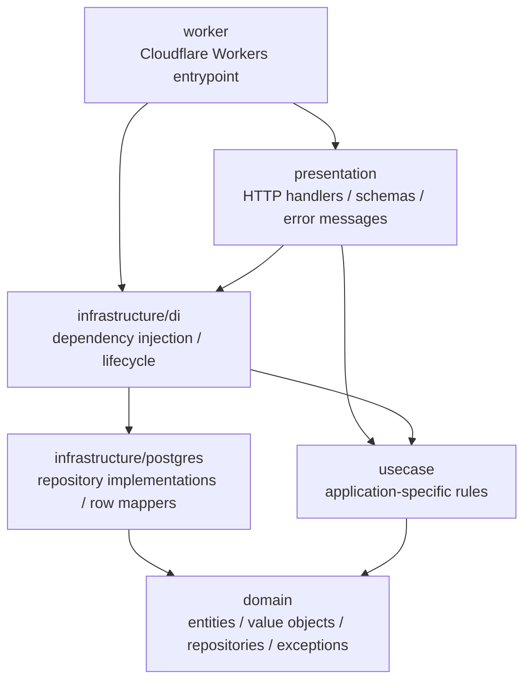

# バックエンド設計

更新日: 2026-10-04

この文書は、バックエンドの構造、各層の責務、依存方向を定める。業務要件とデータ制約は [MVP要件](./mvp-spec.md) と [技術構成](./tech-stack.md) を正とし、ソフトウェア設計は [iktakahiro/dddpy](https://github.com/iktakahiro/dddpy) のオニオンアーキテクチャを基準とする。

参照基準は2026-10-04に確認したcommit `f9a2cfe542b7a08e8a2ca224ad38457814f0dc5b` とする。参照先の変更を自動的に取り込まず、この文書を更新してから実装へ反映する。

## 設計の優先順位

- Entity、Value Object、Repository、UseCase、永続化表現の変換、DI、Presentationの分離はdddpyの構造に従う。
- 家計簿固有の用語、振る舞い、認可、入力範囲、DB制約はこのリポジトリのdocsに従う。
- PythonとFastAPIに固有の構文や仕組みは、TypeScript、Hono、Cloudflare Workersで同じ責務を実現できる形へ置き換える。
- dddpyと業務仕様が衝突した場合は業務仕様を守り、設計上の差異と理由をこの文書へ記録する。

## レイヤーと依存方向

バックエンドは次の4層とWorkerのエントリーポイントで構成する。



依存ルールは次のとおりとする。

- `domain`は他の層、Hono、Clerk、PostgreSQL、Cloudflare Workersへ依存しない。
- `usecase`は`domain`だけに依存し、HTTP、SQL、外部SDKを参照しない。
- `infrastructure`は`domain`のRepositoryを実装し、DBや外部サービスの詳細を閉じ込める。
- `presentation`はHTTP入力をDomainが受け取る値へ変換し、UseCaseを実行し、結果と例外をHTTP表現へ変換する。
- `infrastructure/di`はRepository実装、UseCase、接続ライフサイクルを組み立てる。
- `worker`はCloudflare Workersの`fetch`をHonoアプリへ接続し、ランタイム固有の環境を渡す。業務判断を置かない。

## ディレクトリ構成

各層の中は業務機能ごとに分ける。次はMVPで目指す構成例であり、実装する機能だけを追加する。

```text
src/backend/
├── domain/
│   ├── user/
│   │   ├── entities/
│   │   ├── value-objects/
│   │   ├── repositories/
│   │   └── exceptions/
│   ├── household/
│   ├── expense/
│   ├── category/
│   └── budget/
├── usecase/
│   ├── bootstrap/
│   ├── authorization/
│   ├── expense/
│   ├── category/
│   └── budget/
├── infrastructure/
│   ├── di/
│   │   └── injection.ts
│   └── postgres/
│       ├── database.ts
│       ├── user/
│       ├── household/
│       ├── expense/
│       ├── category/
│       └── budget/
├── presentation/
│   └── http/
│       ├── app.ts
│       ├── authentication/
│       ├── bootstrap/
│       │   ├── handlers/
│       │   ├── schemas/
│       │   └── error-messages/
│       └── shared/
└── worker/
    └── index.ts
```

- 空のディレクトリは先に作らない。
- 複数機能で本当に共有するものだけを`shared`へ置く。
- `index.ts`は、各モジュールが外部へ公開する契約を限定するために使用する。
- テストは対象の実装と同じディレクトリに`*.test.ts`として置く。DB結合テストも対象Repository実装の近くに置く。

## Domain Layer

Domain Layerは家計簿の業務概念と不変条件を表す。外部技術の型を持ち込まない。

### Entity

- 識別子を持ち、識別子によって同一性を判断する業務概念をEntityとして実装する。
- 状態と、その状態を変更する業務上の振る舞いをEntityへ置く。
- constructorへ不正な状態を渡せないようにし、新規作成には必要に応じてfactory methodを使う。
- setterで任意の値を代入させず、`rename`、`recordExpense`など業務上の操作名で状態を変更する。
- DB行やHTTP bodyをそのままEntityとして扱わない。
- TypeScriptでは演算子をオーバーロードできないため、Entityの同一性比較は`equals()`などの明示的なmethodで表す。

### Value Object

- 識別子、金額、日付、対象月、費目名など、値そのものに不変条件または振る舞いがある概念をValue Objectとして実装する。
- Value Objectは生成時に値を検証し、生成後は不変にする。
- Value Objectの等価性は`equals()`などで保持する値を比較する。
- 外部入力からValue Objectを生成できなければ、Presentationが入力不正として扱う。
- DBから不正な値が復元された場合は、成立してはならない永続化状態として扱う。
- 不変条件や振る舞いを持たない内部データまで機械的にclassで包まず、`type`と変換関数を使う。

### Repository

- Repositoryの`interface`は`domain/<feature>/repositories/`へ置く。
- RepositoryはEntityや集約の永続化を抽象化し、SQL、`pg`、DB行の型を公開しない。
- `save`、`findById`、`findAll`、`delete`など、その業務概念に現在必要な操作だけを定義する。
- テーブルごとではなく、Entityまたは集約の境界ごとにRepositoryを設ける。
- 複数Repositoryを同一トランザクションで使う場合も、UseCaseから接続やSQLを操作しない。

### Domain Exception

- 対象なし、不正な状態遷移、業務上の競合など、DomainまたはUseCaseが呼び出し側へ伝える必要がある失敗は、機能ごとの判別可能な例外で表す。
- 例外はHTTP statusや日本語表示文言を持たない。
- 想定外のDB障害やプログラミングエラーをDomain Exceptionへ変換して隠さない。

## UseCase Layer

- 一つのユースケースを一つのクラスとして実装する。
- 各UseCaseは原則として一つのpublic method `execute`だけを公開する。
- 呼び出し側が依存するUseCaseの`interface`と、Repositoryを受け取る具象classを分離する。
- Repositoryはconstructor injectionで受け取る。
- UseCaseはEntityとValue Objectを組み合わせ、アプリケーション固有の処理順を表現する。
- Honoの`Context`、Request、Response、`pg.Client`、Clerk SDK、Workersの`Env`を引数や戻り値に含めない。
- 生成処理や依存の束縛に意味がある場合はfactory functionを用意し、具象classの生成をDIへ集約する。単純な`new`を隠すだけなら必須としない。

```ts
export interface CreateExpenseUseCase {
	execute(input: CreateExpenseInput): Promise<Expense>
}

class DefaultCreateExpenseUseCase implements CreateExpenseUseCase {
	constructor(private readonly expenseRepository: ExpenseRepository) {}

	async execute(input: CreateExpenseInput): Promise<Expense> {
		const expense = Expense.create(input)
		await this.expenseRepository.save(expense)
		return expense
	}
}

export function newCreateExpenseUseCase(
	expenseRepository: ExpenseRepository,
): CreateExpenseUseCase {
	return new DefaultCreateExpenseUseCase(expenseRepository)
}
```

## Infrastructure Layer

### Repository Implementation

- PostgreSQL実装は`infrastructure/postgres/<feature>/`へ置く。
- Domain Repository interfaceを実装し、パラメータ化SQLを実行する。
- DB固有の一意制約、外部キー、ロック、トランザクションのエラーを、必要に応じてDomain Exceptionへ翻訳する。
- SQL結果は必ずDB行の型とmapperで検証し、EntityとValue Objectへ復元してから返す。

### DB row types and mappers

- SQLAlchemy modelに相当するclassは作らず、`ExpenseRow`などの明示的な`type`でDB行を表す。
- `readExpenseRow()`や`toExpense()`などの小さなmapperで、`unknown`またはDB行を検証してDomain modelへ変換する。
- Entityから永続化用parameterへの変換もInfrastructure内で行う。
- DB行、`QueryResult`、`pg`の型をDomainとUseCaseへ返さない。

### Transaction and lifecycle

- Repository実装は同じユースケース内で共有される接続へ束縛する。
- 接続開始、commit、rollback、closeは`infrastructure/di`が管理する。
- UseCase成功時だけcommitし、例外時はrollbackして元の例外を再送出する。
- 家計行のロックやDB制約など、docsで定めた整合性保証はRepository実装とマイグレーションの両方で維持する。
- Cloudflare Workersではリクエストをまたいで可変なRepositoryやDB Clientを共有しない。

### Dependency Injection

- `infrastructure/di/injection.ts`を依存関係の組み立て場所とする。
- Repository実装とUseCaseの生成関数をここで接続する。
- Honoのhandlerからは、DIが提供するUseCase interfaceへ依存する。
- FastAPIの`Depends`やgeneratorを再現せず、TypeScriptのfactory関数とHono middlewareで明示的に組み立てる。
- 接続とトランザクションのライフサイクルが必要なUseCaseは、DIがrequest単位で生成・終了する。

## Presentation Layer

- HTTP routeは機能ごとのhandlerに登録する。
- schemaはHTTP requestとresponseの構造を表し、EntityをそのままJSON化しない。
- handlerは外部入力を検証して必要なDomainの値へ変換し、DIからUseCaseを取得して`execute`する。
- Domain ExceptionをHTTP statusと安定したエラーコードへ変換する。
- 利用者向け日本語文言はAPIレスポンスに埋め込まず、フロントエンドの文言リソースで管理する。
- 認証済みClerk利用者IDだけを内部のUserIdへ解決し、クライアントが送る利用者IDや家計IDを信用しない。

## Worker Layer

- `worker/index.ts`はCloudflare Workersのdefault handlerを公開する。
- Workersの`Env`と`ExecutionContext`をHonoへ渡す。
- Honoアプリの作成とroute登録を呼び出すが、RepositoryのSQLや業務判断を実装しない。
- requestごとの依存生成は`infrastructure/di`へ委譲する。
- Workers bindingsの型はWranglerが生成した`Env`を使う。

## TypeScriptでの適用

- PythonのABCはTypeScriptの`interface`で表す。共有状態や共通実装が必要な場合だけ`abstract class`を使う。
- PythonのSQLAlchemy DTO classは、生SQLと`pg`に合わせてDB行の`type`とmapper関数へ置き換える。
- dddpyのsnake_caseは、識別子をcamelCase、型とclassをPascalCase、ファイル名をkebab-caseとするTypeScriptの命名へ置き換える。
- 用語は`Usecase`ではなく`UseCase`と表記し、具象実装は機械的な`Impl`より責務が分かる`DefaultCreateExpenseUseCase`などの名前を使う。
- Entityの状態は`private`または`#private`にし、業務methodだけで変更する。Value Objectは`readonly`を使い、生成後に変更できないようにする。
- factory functionを設ける場合は`newCreateExpenseUseCase`、Repository実装は`newPostgresExpenseRepository`のように生成対象と技術を名前で示す。
- 非同期I/Oを行うRepositoryとUseCaseは`Promise`を返す。
- HonoやWorkersが要求するdefault export以外は名前付きexportを基本とする。

## 実装時の確認事項

- 新しい機能はDomain model、Repository、UseCase、Infrastructure、Presentationの責務を順に確認する。
- EntityとValue Objectの不変条件が、MVP要件とDB制約の両方に一致しているか確認する。
- Repository interfaceと実装の入出力にDB行やHTTP表現が漏れていないか確認する。
- UseCaseにHTTP、SQL、外部SDKの知識が混入していないか確認する。
- handlerが業務判断を持たず、入力・出力変換と例外変換に留まっているか確認する。
- DIがrequestごとの接続、transaction、後始末を保証しているか確認する。
- 依存方向とテスト配置がこの文書の構造に一致しているか確認する。
