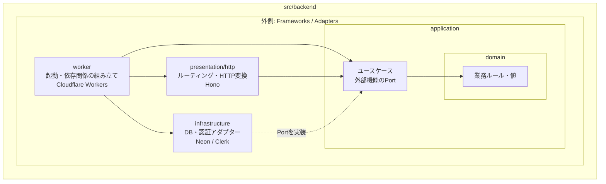

# 家計簿アプリ 技術構成

更新日: 2026-09-23

機能と運用上の要件は [MVP要件](./mvp-spec.md) にまとめる。

## バックエンドの依存関係

矢印は実行時の呼び出し順ではなく、ソースコードの依存方向を表す。依存は外側から内側だけへ向け、`domain`は他の層や外部サービスへ依存しない。

- `worker`はComposition Rootとして、必要な実装を生成して`presentation`へ渡す。
- `presentation`はHTTPをアプリケーションの入力・出力へ変換し、業務ルールを直接実装しない。
- `infrastructure`は`application`が定義したPortを実装し、NeonやClerkの詳細を内側へ漏らさない。
- `application`はユースケースを調整し、`domain`の業務ルールを利用する。
- `domain`は最も内側に置き、Hono、Clerk、Neon、Cloudflare Workersへ依存しない。

## 決定済み

- 画面はReact＋Viteを使用し、TypeScriptで実装する。
- APIはCloudflare Workersで実装し、画面と同じオリジンの`/api`として公開する。
- Cloudflare WorkersのバックエンドもTypeScriptで実装する。フロントエンドと開発言語・型・検証処理を共有し、Clerkと`@neondatabase/serverless`のJavaScript向けSDKを直接利用する。
- WorkerのHTTPフレームワークにはHonoを使い、`/api`のルーティング、認証ミドルウェア、入力検証、HTTPレスポンス変換、共通エラー処理を担当させる。
- バックエンドは軽量なオニオンアーキテクチャとし、依存方向を`presentation/infrastructure -> application -> domain`に限定する。`domain`と`application`はHono、Clerk、Neon、Cloudflare WorkersのAPIへ直接依存しない。
- `src/backend`配下の`domain`には支出・予算などの業務ルール、`application`にはユースケースと外部機能のインターフェース、`infrastructure`にはNeonの生SQLとClerk連携、`presentation/http`にはHono、`worker/index.ts`には依存関係の組み立てを置く。
- MVPではDIコンテナを導入せず、`src/backend/worker/index.ts`で依存を明示的に組み立てる。テーブルごとの機械的なRepositoryは作らず、ユースケースが必要とするDB操作単位でインターフェースを定義する。
- MVPはログイン後の利用を中心とし、検索エンジン向けの公開ページは作らない前提とする。
- Googleログインとセッション管理にはClerkを使う。MVP後も認証方法はGoogleだけとし、メール、パスワード、電話番号などの認証方式は追加しない。
- 家計簿データの保存先にはNeonのPostgreSQLを使う。
- DBアクセスにはORMを使わず、パラメータ化した生SQLをサーバー側で実行する。Drizzleは導入しない。
- WorkerからのDBアクセスには`@neondatabase/serverless`のHTTP接続を使う。複数SQLをまとめる処理は`sql.transaction([...])`の非対話型トランザクションを使い、クエリ途中の結果をアプリケーションコードで判定して次のSQLを変える対話型トランザクションが必要になった場合は接続方式を再検討する。
- DBスキーマの変更は、dbmateで管理するSQLマイグレーションファイルとして記録する。開発時・デプロイ時に適用し、Workerのリクエスト処理中には実行しない。
- Clerkの認証だけで家計データのアクセス制御が完結するとは扱わない。すべての読み書きで、サーバー側がログイン利用者の対象データへの権限を確認する。
- MVPの認可はWorker側で行い、PostgreSQLのRow Level Securityは使用しない。家計への所属条件をDBアクセス処理に集め、別の家計への読み取り・作成・更新・削除を拒否するテストを行う。共有機能を実装する際にRLSの併用を再評価する。
- 一人用のMVPでも家計と利用者の所属関係を別に保存する。新規利用者には個人用の家計を作り、その家計の所有者として所属させる。
- `users`にはアプリ独自の主キー`id`と、一意な`clerk_user_id`を別々に持たせる。家計への所属などの外部キーは`users.id`を参照する。
- `users`にはClerkのメールアドレスと表示名を複製しない。MVPで本人の表示に必要なプロフィールはClerkから取得する。
- 個人用家計を作った利用者への参照は`households`に置き、利用者ごとに一つだけ作れるよう一意制約を設ける。`users`には家計IDを持たせない。家計へのアクセス権は`household_members`で管理する。
- MVPの`household_members`は家計IDと利用者IDの所属関係だけを保存し、役割列は設けない。個人用家計を作った人は`households`で識別する。共有時の権限差が決まった段階で役割を追加する。
- MVPの`households`には家計名を保存しない。共有家計を扱う段階で、名前と表示方法を決める。
- 費目は初期費目の固定順、追加費目の作成順で表示する。名前変更・再表示で順番を変えず、MVPでは並べ替え機能と専用の順序列を設けない。
- 費目の`created_at`は表示順と管理用にだけ使い、費目の有効開始日としては扱わない。追加した費目を、その作成前の日付の支出にも使用できる。
- `categories.updated_at`を持たせ、名前変更・非表示・再表示の更新SQLで`updated_at = now()`を明示する。
- `monthly_budgets`に`created_at`と`updated_at`を持たせる。予算額の更新SQLで`updated_at = now()`を明示する。
- `users`には`updated_at`を設けない。MVPの`users`に更新対象の列はないため、将来、利用者設定などを追加した時点で再検討する。
- `users.clerk_user_id`は利用者作成時に保存し、その後は変更しない。Googleアカウントのメールアドレス変更では付け替えず、別のClerk利用者IDへの移行やアカウント統合はMVPで扱わない。
- `users.created_at`はDBの`now()`で記録する。利用開始時期や初期化処理の調査に使い、MVPの画面には表示しない。
- `households.created_at`はDBの`now()`で記録する。将来、利用者登録とは別の時点で作られる共有家計も扱えるよう、家計自体の作成時刻として保持する。MVPの画面には表示しない。
- `households`には`updated_at`を設けない。MVPには家計名や設定などの更新対象がないため、変更可能な列を追加する時点で再検討する。
- `categories.seed_key`は初期費目だけに設定し、`food`、`daily_goods`、`housing`、`utilities`、`communications`、`transportation`、`medical`、`entertainment`、`other`の9種類だけをDBの`CHECK`制約で許可する。利用者が追加した費目では`NULL`とする。
- `categories.seed_key`は作成後に変更しない。費目の更新APIでは入力として受け取らず、MVPでは変更防止用のDBトリガーを設けない。
- 費目名はAPIで前後の空白を除去し、DBでも先頭・末尾が空白文字ではないことを`CHECK`制約で保証する。文字数制約と合わせ、アプリ以外のSQLから不整合な名前が保存されることも防ぐ。
- 支出の費目は任意とし、`expenses.category_id`の`NULL`を「未分類」として扱う。未分類の支出も月全体の集計に含めるが、費目別予算と残額は持たせない。費目絞り込みでは`NULL`を未分類として指定できるようにする。
- すべての費目を非表示にできる。表示中の費目が0件でも、支出は未分類として登録できるため、最低1件の表示中費目を要求する制約は設けない。
- `users`・`households`・`categories`・`expenses`の主キーはPostgreSQLの`uuid`型とし、DBで`gen_random_uuid()`により生成する。`household_members`・`budget_periods`・`monthly_budgets`は、それぞれの組み合わせを複合主キーとする。
- 支出額と費目別予算額は1円単位の`integer`型で保存する。支出は正、予算は0以上の制約を設ける。`SUM(integer)`の結果は`bigint`なので、APIで安全に数値として扱える範囲を確認する。
- PostgreSQLから受け取る`bigint`の集計値は、APIでJavaScriptの安全な整数範囲内か確認してから`number`へ変換する。範囲を超えた場合は成功レスポンスを返さず、集計エラーとして扱う。
- 支出額は1〜2,147,483,647円を画面・API・DBで検証する。
- 費目別予算額は0〜2,147,483,647円を画面・API・DBで検証する。
- 支出日は時刻を持たない`date`型で保存する。予算の対象月も`date`型で保存し、その月の1日を使う。
- MVPの「今日」と「今月」は`Asia/Tokyo`で判定する。支出の未来日付チェックと最初に表示する月に同じ基準を使う。利用者が入力した支出日は日付そのものとして保存し、タイムゾーン変換しない。
- 支出日にアプリ独自の下限は設けない。APIで厳密な`YYYY-MM-DD`形式と実在する日付を検証し、`Asia/Tokyo`の今日以前だけを許可する。
- 支出・費目・予算などの家計データは家計IDに紐づける。MVPでは一つの家計に一人だけ所属し、共有操作は提供しない。
- 個人用家計は、Clerkで認証した利用者からの最初のAPIリクエスト時に作成する。家計・所属・初期費目は、同時リクエストでも重複や作成途中の状態が残らないよう、DBの一意制約とトランザクションを使って初期化する。作成用の`user.created` Webhookには依存しない。
- 初期マイグレーションで、`households`の作成時に初期費目9件を同じトランザクション内へ作成するDBトリガーを定義する。初期費目の`seed_key`と家計内の一意制約で重複を防ぐ。
- 最初の認証済みAPIリクエストでは、家計・所属・初期費目とともに日本時間の当月の`budget_periods`を作る。費目別予算行は作らず、全費目を未設定として初期化する。後から前月の予算を入力しても、初期化済みの当月には自動反映しない。
- 個人用家計の作成者は、家計の作成と同じDBトランザクションで`household_members`にも追加する。作成者の所属を保証する循環外部キーは設けず、この初期化処理とテストで整合性を確認する。
- 予算は対象月ごとの行として保存する。初期化や保存では指定された対象月だけを作り、間の未初期化月は作らない。対象月より前で最も新しい初期化済み月から予算を直接引き継ぐ。一度作成した月の予算は、後から過去月を変更しても自動更新しない。
- 過去月を閲覧するだけでは`budget_periods`や`monthly_budgets`を作成・更新しない。
- `budget_periods`のない過去月の閲覧画面では、予算未設定として表示し、前月の予算額を確定済みの月予算に見せない。
- 未初期化の過去月で予算編集を開くときは、対象月より前で最も新しい初期化済み月の費目別予算額を下書きの初期入力値として取得する。この時点ではDBへ書き込まず、保存操作時に対象月だけの`budget_periods`と必要な`monthly_budgets`を作成する。
- 月の予算保存は、金額を入力した費目を1回のDBトランザクションで確定する。保存対象に空欄や不正な金額が含まれていれば拒否し、DBを変更しない。対象月の`budget_periods`を作成または確認し、指定された`monthly_budgets`を追加・更新する。予算を未設定に戻す操作は別の削除操作として実行し、該当する`monthly_budgets`行を削除する。途中の費目だけが保存された状態を残さない。
- 「予算を削除」は確認ダイアログの確定後に実行する。金額0の保存は`amount = 0`の行を作成・更新し、未設定とは区別する。
- 予算の保存・削除が成功したら、対象月の予算と集計をAPIから再取得して画面を更新する。保存前の下書きをそのまま正とみなさない。
- 予算保存が失敗した場合は、入力中の下書きを画面に残し、エラーを表示して再試行できるようにする。失敗時は対象月の既存データを変更しない。
- MVPでは予算の同時編集を検出しない。一つの家計に一人だけ所属するため、保存トランザクションが最後に成功した結果を採用する。共有機能の実装時にバージョン番号などによる競合検出を追加する。
- 通常の予算保存APIには、金額が入力された費目だけを含める。未設定の費目は送信せず、未設定へ戻す場合は費目・対象月を指定する「予算を削除」APIを別に呼ぶ。空欄を未設定へ暗黙変換しない。
- MVPの予算削除APIは対象月・費目ごとの操作だけを提供し、複数費目の一括削除は行わない。
- 予算削除の確認画面では、対象月・費目名・現在額を表示し、未設定に戻す操作であることを明示する。
- 費目別予算を未設定に戻す操作では、対象月の`monthly_budgets`行を削除する。`budget_periods`行は残して月の初期化状態を維持する。
- 利用開始月より前の月を初期化するときも、対象月より前で最も新しい初期化済み月があれば、その月の予算行を直接引き継ぐ。該当する月がなければ未設定とする。間の月、現在月、すでに初期化した後続月は作成・再計算しない。
- 費目の非表示は適用を開始する月が分かるように記録する。予算を翌月へ作成するとき、非表示にした費目の行はコピーしない。非表示にした月までの予算行は保持する。
- 費目を再表示しても、過去の予算行から額を補完しない。再表示した月に予算行がなければ未設定のままとし、すでにある予算行は変更しない。
- MVPのAPIには費目の個別削除操作を設けない。誤って追加した未使用の費目も非表示で管理する。将来、家計全体を削除するときだけ費目行も削除する。非表示費目を参照する既存の支出や予算は引き続き表示する。
- 家計を削除したときは、その家計の所属・費目・支出・予算期間・費目別予算も外部キーの`ON DELETE CASCADE`で削除する。費目への参照は連鎖削除にせず、費目だけの削除で支出や予算が消えないようにする。
- 非表示費目を持つ既存支出の更新では、費目IDを変更しないならその非表示費目を許す。費目IDを変更する場合と新規支出の登録では、表示中の費目だけを許す。いずれも同じ家計の費目であることを確認する。
- 支出の作成・更新では費目を指定しないことも許可する。設定済みの費目を外す更新では`category_id`を`NULL`にして未分類へ戻す。
- 支出の削除は`expenses`の行を物理削除する。画面では削除前に確認を求め、集計とCSVは残存する支出行のみを対象にする。
- 支出の編集は`expenses`の該当行を更新し、変更前の金額・日付・費目・メモを保存する履歴テーブルはMVPでは設けない。
- MVPの取引データは支出専用の`expenses`に保存する。収入・返金・口座間の移動を含む共通の取引テーブルは、各機能の要件が決まったときに検討する。
- MVPの`expenses`には入力者IDを保存しない。各家計に一人しか所属しないため、共有機能を実装するときに列を追加できる。既存行の入力者が必要になれば個人用家計の作成者から補完する。
- 同じ日・金額・費目の支出を複数登録できるようにし、これらの列を組み合わせた一意制約は設けない。
- 支出一覧は`expense_date DESC, created_at DESC, id DESC`で並べる。編集では`created_at`を変えないため、同じ日付内で編集した支出が先頭へ移動しない。
- MVPの支出一覧APIは、選択した1か月分をページ分割せずに返す。実際の利用件数が増えた場合にカーソル方式を追加する。
- 費目による支出一覧の絞り込みは、取得済みの1か月分をブラウザ側で処理する。費目を切り替えるたびにAPIへ再問い合わせしない。
- `expenses.updated_at`はMVPから保持し、支出が最後に変更された時刻を記録する。支出一覧の並び順には使わない。
- 支出を更新するSQLでは、変更する列とともに`updated_at = now()`を明示する。MVPでは更新時刻を変更するDBトリガーを設けない。
- 支出メモはAPIで前後の空白を取り除き、空文字になった場合は`NULL`として保存する。500文字を上限とし、画面とAPIで検証する。DBでも`char_length(memo) <= 500`の制約を設ける。

## MVPのDB設計

| テーブル | 主な内容 |
| --- | --- |
| `users` | アプリ独自の利用者IDと一意なClerk利用者ID。Clerkのメールアドレスと表示名は複製しない。 |
| `households` | 家計ID、個人用家計を作った利用者ID。利用者ごとに一つだけ作る。 |
| `household_members` | 家計IDとアプリ独自の利用者ID。MVPでは個人用家計を作った人だけが所属する。 |
| `categories` | 家計ID、名前、入力候補から外した状態、初期費目の識別子。名前を変えても過去の支出は同じ費目を参照する。 |
| `expenses` | 家計ID、任意の費目ID、支出日（`date`）、1円単位の金額（`integer`）、任意のメモ。費目IDが`NULL`なら未分類。MVPでは入力者IDを保存しない。 |
| `budget_periods` | 家計IDと対象月（月初の`date`）。その月の予算を引き継ぎ済みかを記録する。費目別予算がすべて未設定の月も識別できる。 |
| `monthly_budgets` | 家計ID、費目ID、対象月（月初の`date`）、1円単位の設定額（`integer`）。行がなければ未設定、0円の行があれば明示的な0円設定。 |

- 支出で費目を指定した場合と予算の費目は、同じ家計に属することをDBの外部キーなどでも保証する。
- 所属は家計IDとアプリ独自の利用者IDの組を一意にし、個人用家計も利用者ごとに一つだけ作れるようにする。
- `household_members`の主キーは家計ID・利用者ID、`budget_periods`の主キーは家計ID・対象月、`monthly_budgets`の主キーは家計ID・対象月・費目IDとする。これらに別の単独IDは設けない。
- ログイン利用者から所属家計を取得する検索と将来の家計共有に備え、`household_members(user_id)`のインデックスを設ける。複合主キーは`household_id`から始まるため、`user_id`だけの検索にはこの別インデックスを使う。
- `monthly_budgets`は主キーの先頭が家計ID・対象月であり、通常の月次取得に使えるため、MVPでは追加インデックスを設けない。
- 予算期間の初期化、予算保存、費目の非表示・再表示は、DBトランザクション内で対象の`households`行を`SELECT ... FOR UPDATE`によりロックしてから実行する。同じ家計の関連処理を直列化し、別の家計同士は並行して処理できるようにする。
- 家計行のロックとそれに続く予算関連SQLは、Neon HTTP接続の`sql.transaction([...])`へ実行順に並べ、一つの非対話型トランザクションとして実行する。途中で失敗した場合は全体をロールバックする。
- 予算関連トランザクションの分離レベルはPostgreSQL標準の`READ COMMITTED`とする。同一家計の競合は`SELECT ... FOR UPDATE`で直列化し、MVPでは`SERIALIZABLE`による競合検出と再試行処理を追加しない。
- 予算関連トランザクションでは家計行をロックする前に`SET LOCAL lock_timeout = '3s'`を実行する。3秒以内にロックを取得できなければ全体を失敗させ、APIは再試行可能な競合エラーとして返す。画面は入力中の下書きを保持する。
- 未初期化月の予算引き継ぎは、家計行のロック後に対象月だけを作成する一つのパラメータ化SQLで実行する。間の未初期化月には書き込まない。
- 予算初期化SQLは冪等にする。対象月の`budget_periods`を`ON CONFLICT DO NOTHING RETURNING month_start`で追加し、新規作成できた場合だけ予算を引き継ぐ。`monthly_budgets`の追加も`ON CONFLICT DO NOTHING`で保護し、再送時に初期化済み月の予算を上書きしない。
- 対象月より前で最も新しい初期化済み月に存在する`monthly_budgets`行だけをコピーする。その月で予算行を削除して未設定に戻した費目は、それより古い月の値を検索して復活させず、対象月も未設定とする。
- コピー元の予算行が`amount = 0`なら、明示的な0円設定として対象月にも行をコピーする。行がない未設定とは区別する。
- 引き継ぎで新しく作成する`monthly_budgets`行は、`created_at`と`updated_at`の両方にコピー実行時のDB時刻を設定する。コピー元の時刻は引き継がず、その月の行が作られた時刻を記録する。その後の手動変更時だけ`updated_at`を更新する。
- 対象月の`budget_periods.initialized_at`には、予算状態をDBへ作成したトランザクション時刻を設定する。対象月そのものの日付は入れない。
- MVPの予算APIは`Asia/Tokyo`の今月以前だけを受け付け、未来月の閲覧・編集・初期化を拒否する。新しい月は、その月になった後の最初の利用時に、それより前で最も新しい初期化済み月から直接引き継ぐ。
- 予算引き継ぎSQLはPostgreSQLのストアドプロシージャにせず、`infrastructure/db`内のアプリケーションコードとしてリポジトリで管理する。`application`は予算初期化のインターフェースを呼び、`domain`はSQLやNeonへ依存しない。
- 支出の未来日付禁止はAPIでも確認する。
- `budget_periods`と`monthly_budgets`の対象月が月初日であることをDBの制約でも保証する。
- 支出一覧と月次集計のため、`expenses(household_id, expense_date DESC, created_at DESC, id DESC)`のインデックスを設ける。
- 費目による支出一覧の絞り込みは取得済みの月次データに対してブラウザ側で行うため、`expenses.category_id`用の追加インデックスはMVPでは設けない。
- 初期費目の識別子を名前と分け、利用者が名前を変更・非表示にしても初期化時に重複して作成しない。
- 費目一覧は家計内の件数が少なく、`(household_id, lower(name))`の一意インデックスも家計IDから始まるため、表示順専用の追加インデックスはMVPでは設けない。
- 費目名は家計内で一意にする。初期費目と追加費目を区別せず、非表示の費目も一意制約の対象に含める。別の家計では同名を許す。
- 英字の大文字・小文字だけが異なる費目名は同名として扱う。保存する表示名は入力表記を保ち、DBでは`(household_id, lower(name))`の一意インデックスで保証する。
- 費目名はAPIで前後の空白を取り除いてから保存し、1〜50文字を画面・API・DBで検証する。空白だけの名前を拒否し、整えた保存後の名前を家計内の同名判定に使う。
- 口座、カード、定期支出の自動登録に使うテーブルはMVPの対象外とする。

### `users`の列

| 列 | 型・制約 | 用途 |
| --- | --- | --- |
| `id` | `uuid PRIMARY KEY DEFAULT gen_random_uuid()` | アプリ内の利用者ID。 |
| `clerk_user_id` | `text NOT NULL UNIQUE` | Clerkから受け取る、作成後に変更しない利用者ID。 |
| `created_at` | `timestamptz NOT NULL DEFAULT now()` | アプリ内の利用開始時刻。画面には表示しない。 |

メールアドレスと表示名は`users`に保存しない。`clerk_user_id`を変更する更新APIも設けない。

### `households`の列

| 列 | 型・制約 | 用途 |
| --- | --- | --- |
| `id` | `uuid PRIMARY KEY DEFAULT gen_random_uuid()` | 家計ID。 |
| `personal_owner_user_id` | `uuid NOT NULL UNIQUE REFERENCES users(id) ON DELETE NO ACTION` | 個人用家計を作った利用者。一人につき一つを保証し、利用者だけの削除を防ぐ。 |
| `created_at` | `timestamptz NOT NULL DEFAULT now()` | 家計の作成時刻。画面には表示しない。 |

MVPでは家計名と`updated_at`を保存しない。

### `household_members`の列

| 列 | 型・制約 | 用途 |
| --- | --- | --- |
| `household_id` | `uuid NOT NULL REFERENCES households(id) ON DELETE CASCADE` | 所属先の家計。 |
| `user_id` | `uuid NOT NULL REFERENCES users(id)` | 所属する利用者。 |

主キーは`(household_id, user_id)`。利用者から所属家計を引くため、`user_id`に別のインデックスを設ける。`user_id`側の外部キーは連鎖削除にせず、退会時は家計を先に削除する。
個人用家計の作成者の所属行は、家計と同じトランザクションで作成する。循環外部キーは設けない。

### `categories`の列

| 列 | 型・制約 | 用途 |
| --- | --- | --- |
| `id` | `uuid PRIMARY KEY DEFAULT gen_random_uuid()` | 費目ID。 |
| `household_id` | `uuid NOT NULL REFERENCES households(id) ON DELETE CASCADE` | 所属する家計。 |
| `name` | `text NOT NULL CHECK (char_length(name) BETWEEN 1 AND 50 AND name !~ '^[[:space:]]' AND name !~ '[[:space:]]$')` | 前後の空白を除いた表示名。家計内で一意。 |
| `seed_key` | `text NULL CHECK (seed_key IN ('food', 'daily_goods', 'housing', 'utilities', 'communications', 'transportation', 'medical', 'entertainment', 'other'))` | 初期費目の固定識別子。追加費目では`NULL`。名前変更後も初期化時の重複を防ぐ。 |
| `hidden_at` | `timestamptz NULL` | 入力候補から外した時刻。再表示時は空にする。 |
| `created_at` | `timestamptz NOT NULL DEFAULT now()` | 追加された時刻。 |
| `updated_at` | `timestamptz NOT NULL DEFAULT now()` | 最後に名前・表示状態を変更した時刻。更新SQLで`now()`へ変更する。 |

初期費目は`seed_key`の固定順、追加費目は`created_at`と`id`の順で表示し、専用の順序列と表示順専用インデックスは設けない。`(household_id, lower(name))`を一意にし、初期費目の`seed_key`も家計内で一意にする。費目の更新SQLでは`seed_key`を変更しない。
非表示・再表示を切り替える前に、現在月が未初期化なら現在月だけを初期化し、過去の月の引き継ぎが後から現在の表示状態で変わらないようにする。間の月は作らない。
予算期間の初期化と費目の表示状態変更は、同じトランザクション内で対象の`households`行をロックして実行する。

### `expenses`の列

| 列 | 型・制約 | 用途 |
| --- | --- | --- |
| `id` | `uuid PRIMARY KEY DEFAULT gen_random_uuid()` | 支出ID。 |
| `household_id` | `uuid NOT NULL REFERENCES households(id) ON DELETE CASCADE` | 所属する家計。 |
| `category_id` | `uuid NULL` | 任意の費目。同じ家計に属することを複合外部キーで保証し、`NULL`は未分類を表す。 |
| `expense_date` | `date NOT NULL` | 支出が発生した日。 |
| `amount` | `integer NOT NULL CHECK (amount BETWEEN 1 AND 2147483647)` | 1円単位の支出額。 |
| `memo` | `text NULL CHECK (char_length(memo) <= 500)` | 前後の空白を除いた任意のメモ。空なら`NULL`、最大500文字。 |
| `created_at` | `timestamptz NOT NULL DEFAULT now()` | 登録時刻。 |
| `updated_at` | `timestamptz NOT NULL DEFAULT now()` | 最後に編集した時刻。更新SQLで`now()`へ変更する。 |

費目への参照は`(household_id, category_id)`から`categories(household_id, id)`への複合外部キーとする。`categories(household_id, id)`にも一意制約を設ける。`category_id`が`NULL`なら外部キーの検査対象外となり、未分類として扱う。費目への参照は`ON DELETE CASCADE`にしない。
MVPでは入力者の利用者IDを保存しない。

### `budget_periods`の列

| 列 | 型・制約 | 用途 |
| --- | --- | --- |
| `household_id` | `uuid NOT NULL REFERENCES households(id) ON DELETE CASCADE` | 家計。 |
| `month_start` | `date NOT NULL CHECK (EXTRACT(DAY FROM month_start) = 1)` | 対象月の1日。 |
| `initialized_at` | `timestamptz NOT NULL DEFAULT now()` | その月の予算初期化時刻。 |

主キーは`(household_id, month_start)`。費目別予算が0件でも、初期化済みの月を識別できる。
初期化時は`ON CONFLICT DO NOTHING`を使い、`RETURNING`で新しく作成された月だけを後続の予算コピー対象にする。

### `monthly_budgets`の列

| 列 | 型・制約 | 用途 |
| --- | --- | --- |
| `household_id` | `uuid NOT NULL` | 家計。対象月・費目とともに複合外部キーで保証する。 |
| `month_start` | `date NOT NULL CHECK (EXTRACT(DAY FROM month_start) = 1)` | 対象月の1日。 |
| `category_id` | `uuid NOT NULL` | 同じ家計に属する費目。 |
| `amount` | `integer NOT NULL CHECK (amount BETWEEN 0 AND 2147483647)` | 1円単位の費目別予算。 |
| `created_at` | `timestamptz NOT NULL DEFAULT now()` | 予算行を作成した時刻。 |
| `updated_at` | `timestamptz NOT NULL DEFAULT now()` | 予算額を最後に変更した時刻。更新SQLで`now()`へ変更する。 |

主キーは`(household_id, month_start, category_id)`。`budget_periods(household_id, month_start)`へ`ON DELETE CASCADE`の複合外部キーを張る。`categories(household_id, id)`への複合外部キーは連鎖削除にしない。行がなければ未設定、0円の行があれば明示的な0円設定とする。
「予算を削除」操作ではこの行を削除し、`budget_periods`は削除しない。通常の保存で空欄を未設定へ変換しない。
主キーを家計ID・対象月の月次取得にも使い、MVPではこのテーブルに別のインデックスを追加しない。
予算の初期化・保存時は対象の`households`行を先にロックし、同じ家計に対する同時処理を直列化する。
初期化による追加は`ON CONFLICT DO NOTHING`とし、通常の予算保存で行う明示的な更新とは分ける。

## MVP後の退会機能案

退会機能はMVPに含めず、実装時に要件を再確認する。現時点では、確認画面を経たアプリ内の専用操作からNeonの家計データとClerkアカウントを削除する案とする。削除処理中の再初期化を防ぐ必要がある場合は、`users.deletion_started_at`などの状態を追加する。Clerk側から削除された場合の`user.deleted` Webhookによる残存データ削除も、その時点で設計する。

## MVPのAPI契約

### 共通ルール

- APIは同一オリジンの`/api`以下に置き、すべてClerkの認証を必須とする。
- MVPではクライアントから`household_id`を受け取らない。Clerk利用者IDからアプリ利用者と所属家計をサーバー側で特定し、すべてのSQLへ家計ID条件を含める。
- 日付は`YYYY-MM-DD`、対象月は月初日の`YYYY-MM-01`、金額はJavaScriptの安全な整数範囲を確認したJSON numberで返す。
- エラーは`{ "error": { "code": "...", "fields": { ... } } }`を基本形とする。画面に表示する日本語はフロントエンドの多言語文言ファイルで管理し、APIのエラーコードから変換する。
- 存在しないデータと、別家計に属していて操作できないデータは、どちらも`404`として返して所属情報を推測できないようにする。
- 作成成功は`201`、取得・更新成功は`200`、削除成功は本文なしの`204`を基本とする。

### 初期化

| メソッド・パス | 用途 |
| --- | --- |
| `POST /api/bootstrap` | 認証済み利用者、個人用家計、所属、初期費目、今月の予算期間を冪等に初期化する。ログイン後とアプリ起動時に呼ぶ。 |

### 月次画面

| メソッド・パス | 用途 |
| --- | --- |
| `GET /api/months/:month` | 指定月の予算、支出、月全体と費目別の集計を取得する。未初期化の過去月は書き込まず、未設定として返す。 |
| `GET /api/months/:month/budget-draft` | 未初期化月の予算編集用に、それより前で最も新しい初期化済み月から下書きを返す。DBは変更しない。 |

### 支出

| メソッド・パス | 用途 |
| --- | --- |
| `POST /api/expenses` | 日付・金額、任意の費目・メモで支出を作成する。 |
| `PATCH /api/expenses/:expenseId` | 支出の日付・金額・費目・メモを更新する。費目は`null`で未分類へ戻せる。 |
| `DELETE /api/expenses/:expenseId` | 確認済みの支出を物理削除する。 |

月内の支出一覧は`GET /api/months/:month`に含める。MVPでは支出一覧専用の取得APIとページ分割APIを設けない。

### 費目

| メソッド・パス | 用途 |
| --- | --- |
| `GET /api/categories` | 表示中・非表示を含む家計の費目一覧を取得する。 |
| `POST /api/categories` | 追加費目を作成する。`seed_key`は受け取らない。 |
| `PATCH /api/categories/:categoryId` | 費目名を変更する。 |
| `POST /api/categories/:categoryId/hide` | 現在月が未初期化なら現在月だけを初期化してから、費目を非表示にする。 |
| `POST /api/categories/:categoryId/show` | 現在月が未初期化なら現在月だけを初期化してから、費目を再表示する。 |

### 予算

| メソッド・パス | 用途 |
| --- | --- |
| `PUT /api/months/:month/budgets` | 金額を入力した複数費目の予算を一つのトランザクションで追加・更新する。未初期化なら対象月だけを初期化する。 |
| `DELETE /api/months/:month/budgets/:categoryId` | 一つの費目別予算を削除して未設定へ戻す。`budget_periods`は残す。 |

通常の予算保存と削除を別APIにし、空欄を削除へ暗黙変換しない。未来月はすべての月次・予算APIで拒否する。
